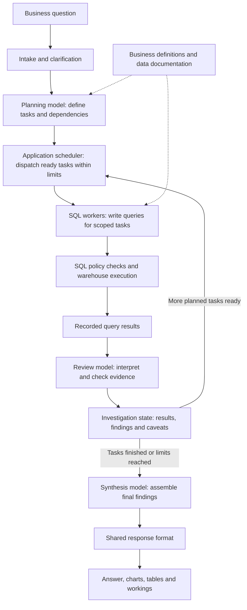
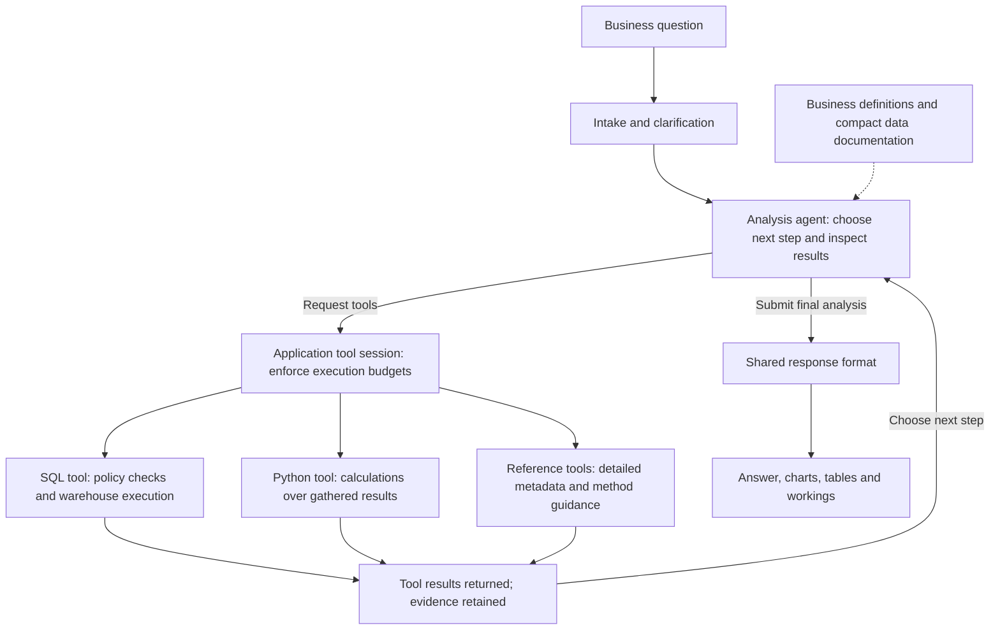

# Analytics agent architecture — diagram handoff

Two simplified views of the investigation architecture, with matching entry and exit points. These deliberately omit hosting, authentication, storage services and optional narration so the change in orchestration remains clear. No client or product names are included.

## Earlier design: multi-agent orchestration

**Suggested caption:** An upfront plan divides the investigation into tasks. A scheduler assigns ready work to scoped workers, gathers reviewed evidence, and passes the accumulated findings to a final synthesis step.

**Design notes:**

- The SQL-workers box represents multiple task executions; independent work can run in parallel. It does not imply a fixed number of agents.
- The return arrow represents progressing through the task dependencies, not an automatic new planning call after every result.
- Planning, SQL generation, evidence review and synthesis are separate model roles/calls. They need not use different underlying model families.
- The scheduler, policy checks and evidence storage are application code.
- This is based on the retained multi-agent implementation, not an exact reconstruction of every earlier release. Optional/compatibility Python workers and failure paths are omitted.

## Current design: single-agent investigation loop

**Suggested caption:** One analysis agent chooses what to investigate next using the results already gathered. The application executes its tools within defined limits and retains the evidence used to assemble the answer.

**Design notes:**

- “Single agent” refers to the investigation loop. Intake and optional supporting model calls still exist.
- Independent tool requests can run concurrently; a single investigation agent does not mean every query executes serially.
- SQL and Python produce analytical evidence. Reference tools supply documentation and method guidance, not observed business results.
- The agent submits a structured final payload; validation of its format does not establish factual correctness.
- Both designs feed the same response contract. Application rules construct supported charts from returned data and the visual brief.

## The change to emphasise

The earlier design delegates an upfront task plan to workers. The current design lets the analysis agent choose its next action after inspecting the evidence. Access policies, execution limits, evidence retention and response rendering remain application responsibilities in both designs.

For a side-by-side visual, keep the question, intake and final output boxes identical. Distinguish model roles from application code with two colours or shapes. Keep data/reference connections visually secondary to the main investigation flow. No speed or accuracy improvement is implied by the diagrams.
